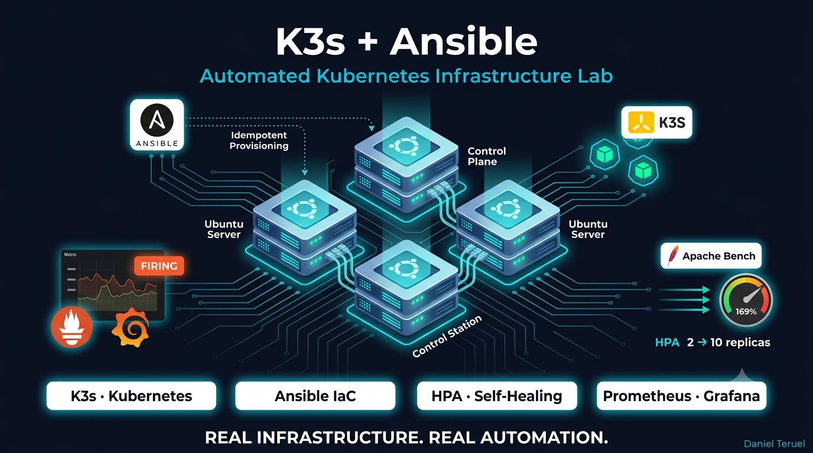

# K3s Cluster with Ansible — Kubernetes Infrastructure Lab

Automated provisioning of a multi-node Kubernetes cluster (K3s) on VMware Workstation using Ansible, 3-tier application deployment, autoscaling, self-healing and full observability with Prometheus and Grafana.

## Overview

I designed and built a complete local Kubernetes infrastructure using **VMware Workstation** — three Ubuntu Server 24.04 nodes managed from a dedicated Control Station via SSH and Ansible Playbooks.

Once the cluster was fully operational, I deployed a 3-tier application stack (Nginx + Adminer + MariaDB) in a dedicated namespace, configured horizontal autoscaling based on CPU consumption, validated self-healing via probe fault injection, and deployed a full observability stack with Prometheus and Grafana — including real-time alerting based on pod restart metrics.

## Architecture

| Node | IP | Role |
|---|---|---|
| Control Station | 192.168.1.10 | Ubuntu Server — Ansible + kubectl |
| Master / Control Plane | 192.168.1.11 | K3s server |
| Worker | 192.168.1.12 | K3s agent |

Private NAT network under VMware Workstation. Passwordless push management via SSH + Ansible from the Control Station.

## Project Structure

| Folder | Contents |
|---|---|
| [ansible/inventory](./ansible/inventory/) | Node inventory with IPs and SSH config |
| [ansible/playbooks](./ansible/playbooks/) | Network setup, K3s master and worker provisioning |
| [k8s/namespace](./k8s/namespace/) | Namespace definition |
| [k8s/app](./k8s/app/) | Deployments: Nginx, Adminer, MariaDB |
| [k8s/storage](./k8s/storage/) | PersistentVolumeClaims |
| [k8s/autoscaling](./k8s/autoscaling/) | HorizontalPodAutoscaler |
| [k8s/observability](./k8s/observability/) | Prometheus, Grafana Helm values, Ingress |
| [docs](./docs/) | Architecture decisions |

## Project Phases

### Pre-Phase — IaC with Ansible
- Static network configuration with Netplan and UFW firewall rules per node
- Idempotent K3s provisioning via Ansible Playbooks — safe to re-run at any time

### Phase A — Ingress with Traefik
- Ingress Resource routing monitoring traffic through Traefik (K3s native)
- `http://grafana.local` accessible on port 80 — no high NodePorts required

### Phase B + E — Storage, Secrets and ConfigMaps
- PersistentVolumeClaims with `local-path` provisioner for MariaDB data persistence
- Kubernetes Secrets for DB credentials; ConfigMaps for Nginx static configuration
- Validated: MariaDB survives pod deletion and recreation with no data loss

### Phase C — 3-Tier Application (namespace `produccion`)
1. **Frontend:** Declarative multi-replica Nginx
2. **DB Management:** Adminer
3. **Backend:** MariaDB with PVC
- Internal service-to-service communication via Kubernetes Services

### Phase D — HPA Autoscaling
- HorizontalPodAutoscaler configured on Nginx Deployment (CPU-based)
- Validated with `ab -n 100000`: automatic scale-out from 2 to 10 replicas at 169% CPU load

### Phase F — Liveness and Readiness Probes
- Health probes on Nginx pods for application resilience
- Self-healing validated: injecting `/error` route → livenessProbe failure → automatic pod restart by Kubernetes

### Phase G — Observability and Alerting
- Full Prometheus + Grafana stack deployed via Helm
- Alert rule: `increase(kube_pod_container_status_restarts_total[5m])`
- Validated: alert transitions to `Firing` in real time during stress tests

## Key Design Decisions

**Why K3s instead of full Kubernetes?**
K3s is production-grade and resource-efficient — ideal for a 3-node lab on VMware with limited RAM. Same API, same manifests, same kubectl.

**Why Traefik instead of ingress-nginx?**
Traefik is bundled with K3s by default. Using it avoids an extra Helm install and demonstrates native K3s capabilities.

**Why local-path provisioner for storage?**
Native to K3s, zero configuration required. Sufficient for lab workloads and mirrors the PVC/PV lifecycle of production storage classes.

**Why Ansible over shell scripts?**
Idempotency. Playbooks can be re-run after any failure without side effects — critical when provisioning VMs that may be snapshotted and restored.

## What I Built

- 3-node Kubernetes cluster on VMware Workstation provisioned fully via Ansible
- Idempotent network and firewall configuration with Netplan and UFW
- 3-tier application stack in a dedicated namespace with persistent storage
- Horizontal autoscaling validated under real CPU load with Apache Bench
- Self-healing validated via livenessProbe fault injection
- Full observability stack with Prometheus and Grafana via Helm
- Real-time alerting based on pod restart rate — alert transitions to Firing during stress tests
- Traefik Ingress for clean domain-based routing (grafana.local)

## Tech Stack

**Infrastructure:** VMware Workstation, Ubuntu Server 24.04 LTS, Netplan, UFW, SSH Keys

**Kubernetes:** K3s, Traefik Ingress Controller, local-path provisioner, HPA, PVC, Secrets, ConfigMaps, Liveness/Readiness Probes

**Application:** Nginx 1.25, Adminer 4.8, MariaDB 10.11

**Observability:** Prometheus, Grafana, Helm, Apache Bench

**Automation:** Ansible, YAML Playbooks, inventory.ini

**Certification context:** Microsoft Certified: Azure Administrator Associate (AZ-104)

## Quick Start

```bash
# 1. Provision network and firewall on all nodes
ansible-playbook -i ansible/inventory/inventory.ini ansible/playbooks/setup-network.yml

# 2. Install K3s Control Plane
ansible-playbook -i ansible/inventory/inventory.ini ansible/playbooks/install-k3s-master.yml

# 3. Join Worker node
ansible-playbook -i ansible/inventory/inventory.ini ansible/playbooks/install-k3s-worker.yml

# 4. Deploy application stack
kubectl apply -f k8s/namespace/
kubectl apply -f k8s/storage/
kubectl apply -f k8s/app/
kubectl apply -f k8s/autoscaling/
kubectl apply -f k8s/observability/
```

## Lab Specs

| Machine | OS | IP | RAM | Role |
|---|---|---|---|---|
| Control Station | Ubuntu Server 24.04 | 192.168.1.10 | 2 GB | Ansible + kubectl |
| Master | Ubuntu Server 24.04 | 192.168.1.11 | 2 GB | K3s Control Plane |
| Worker | Ubuntu Server 24.04 | 192.168.1.12 | 2 GB | K3s Agent |

**Hypervisor:** VMware Workstation

## Status

- [x] Network and firewall — Netplan + UFW via Ansible
- [x] K3s cluster — Control Plane + Worker provisioned via Ansible
- [x] Namespace and application stack — Nginx, Adminer, MariaDB
- [x] Persistent storage — PVC with local-path provisioner
- [x] Secrets and ConfigMaps — credentials and static config decoupled
- [x] Traefik Ingress — grafana.local on port 80
- [x] HPA — scale from 2 to 10 replicas under load
- [x] Liveness and Readiness Probes — self-healing validated
- [x] Observability — Prometheus + Grafana via Helm
- [x] Alerting — Firing alert on pod restart rate validated
- [x] Documentation — architecture decisions in docs/

---

## Contact

[](https://www.linkedin.com/in/dteruelt/)
[](https://github.com/DanielTeruel)
